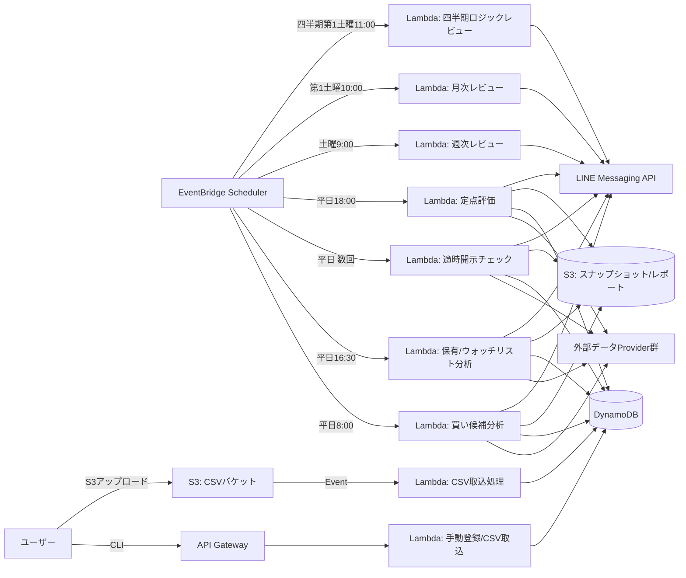

# 日本株 長期・高配当・優待重視 売買支援システム — 初期設計提案

作成日: 2026-07-24
ステータス: DRAFT（ユーザー確認待ち。承認後に開発フェーズへ進む）

本ドキュメントは、要求仕様（53項目）を踏まえた最初の設計提案です。要件24節の指示に従い、
コードは書かず、以下の内容のみを提示します。

---

## 1. 確定要件（サマリ）

- 対象は**日本株のみ**。REIT・ETFは除外。
- 目的は**投資判断支援**であり、証券会社への**自動発注は行わない**。最終判断は常にユーザー。
- 評価軸は「配当利回り＋株主優待利回り」＝**総合利回り**（基本閾値 3.5%）。
- 判定は HOLD / WATCH / PARTIAL_PROFIT_TAKE / FULL_PROFIT_TAKE / SELL / URGENT_REVIEW の6区分。
  「利確」と「投資前提悪化による売却」は明確に分離する。
- 数値計算（株価・利回り・適正価格・スコア等）はすべて **Python** で行い、**LLMは文章整理・要約・リスク抽出にのみ使用**（数値の創作禁止）。
- データ欠落時は推測補完せず、**推奨を出さない**。データ鮮度・出典を必ず記録。
- すべての推奨は**不変スナップショット**として保存し、事後に妥当性を検証できる（振り返り機能）。
- 判断ロジックの変更は**自動反映しない**。改善案 → バックテスト → ユーザー承認 → ルールバージョン発行、という承認フローを経る。
- AWS サーバーレス構成（Lambda / EventBridge Scheduler / DynamoDB / S3 / Secrets Manager / API Gateway）、IaCはSAMまたはCDK。
- 外部データ取得は**プロバイダーインターフェースとして分離**し、実装を差し替え可能にする。
- 16（+振り返り系12）のサービスに責務分離。
- MVPスコープは23節・52節の通り、手動/CSV登録・前日終値ベース分析・買い/利確/前提悪化判定・LINE通知・履歴保存・モックデータテストまで。自動発注、リアルタイム監視、板情報解析、完全自動売買判断、複雑なWeb画面、複数ユーザー対応はMVP対象外。

---

## 2. 未確定事項（推奨初期値つき）

| # | 論点 | 推奨初期値 | 理由 |
|---|---|---|---|
| 1 | 利用者数 | **単一ユーザー（本人専用）** | 複数ユーザー対応はMVP対象外と明記されているため。将来複数ユーザー化する場合はテーブルにuser_idパーティションを追加する設計にしておく。 |
| 2 | 投資助言業法への抵触リスク | **個人の自己利用に限定し、第三者への提供・販売はしない前提で進める** | 不特定多数へ「投資判断」を提供すると投資助言業（金商法）に該当し得るため。第三者提供の予定がある場合は別途法務確認が必要と明記し、UIにも「本人専用ツール」である旨と「最終判断は利用者が行う」旨を必ず表示。 |
| 3 | market_data_provider の一次ソース | **J-Quants API（有償プラン）を第一候補**、無料枠のみで賄えない場合は補助的に有価証券報告書/EDINETのXBRLで財務データを補完 | 日本株の株価・財務・企業情報をAPIとして構造的に提供する数少ない公式寄りのサービス。個人利用ライセンスで長期株価・財務情報を取得可能。 |
| 4 | dividend_data_provider | **J-Quants（配当情報API）を優先**、なければ有価証券報告書/決算短信からの構造化抽出（LLMは文章整理のみ、数値はXBRL/短信の構造化データから取得） | 配当実績・予想を構造データとして扱う必要があるため。 |
| 5 | shareholder_benefit_provider | **MVPでは手動登録/CSV管理のみとし、自動取得は行わない** | 株主優待情報を構造化APIで提供する公式ソースが存在しない。優待情報サイトのスクレイピングは利用規約違反リスクが高く、13節「推測で補完しない」の原則にも反する。将来的に許諾を得られるデータ提供元が見つかった場合にのみ自動化を検討。 |
| 6 | corporate_action_provider（分割・併合等） | **EDINET/TDnetの適時開示から取得、パーサはPythonでルールベース抽出** | 株式分割・併合は適時開示に明示されるため、LLMではなく構造化パースで対応。 |
| 7 | disclosure_provider（適時開示） | **TDnet（東証適時開示情報閲覧サービス）のRSS/XBRLを利用** | 東証が提供する一次情報源。 |
| 8 | news_provider | **MVPでは対象外、または決算・適時開示の要約に限定** | 一般ニュースAPIは有償かつノイズが多く、投資判断の根拠としての信頼性担保が難しいため後回し。 |
| 9 | LLM利用先 | **Claude API（Anthropic）を想定** | 決算短信・適時開示・ニュースのテキスト要約とリスク抽出用途。数値計算には使用しない。 |
| 10 | 出来高・売買代金の除外基準 | **直近20営業日平均売買代金 3,000万円未満を除外候補**（設定ファイルで変更可） | 流動性の低い銘柄は約定困難・スプレッドが大きく、ロー・ミドルリスク方針に反するため。 |
| 11 | 銀行・証券・保険の個別評価ルール | **MVPでは通常企業と同一ルールを適用しつつ、業種フラグを持たせて将来切替可能にする**。自己資本比率の代わりに自己資本比率規制業種向けの指標（例: 銀行の自己資本比率規制値）を後日追加 | 金融業は財務指標の意味が異なるため拡張ポイントとして設計だけ用意し、MVPでは除外/警告扱いにとどめる。 |
| 12 | 決算・権利確定日データソース | **TDnet適時開示 + 各社IRページの構造化取得（取得できない場合は「未取得」と明示）** | 推測禁止原則のため。 |
| 13 | バックテスト用の過去データ期間 | **直近5年分を初期対象**、将来的に取得可能な範囲まで拡大 | J-Quants等の提供範囲に依存。 |
| 14 | 手数料・税金の扱い | **MVPでは手数料・税金はユーザー入力値をそのまま保存し、リターン計算では「手数料込み」「手数料抜き」両方を算出可能にする**。特定口座源泉徴収税率(20.315%)を設定ファイルのデフォルト値として持つ | 口座区分（特定/NISA/一般）により税制が異なるため。 |
| 15 | 祝日カレンダー | **日本の証券取引所休業日カレンダーをJSON設定として保持し、営業日計算に使用**（内閣府の祝日データ + 年末年始等の証券取引所休業日を手動反映） | 「営業日」ベースの評価期間計算（29節）に必須。 |
| 16 | 開発・検証環境 | **AWS SAM Local / DynamoDB Local を使用したローカル実行環境を用意** | クラウド課金なしに開発・テストを回すため。 |
| 17 | Web画面 | **MVPでは実装しない。CLIとJSON/レポート閲覧のみ**。将来的にAPI Gatewayの上に軽量なWeb UIを追加できる構成にしておく | 23節の指示通り。 |
| 18 | LINE通知の宛先 | **1対1のプッシュ通知（LINE公式アカウント + ユーザーのuserIdを1件のみ登録）** | 単一ユーザー運用のため。 |
| 19 | データ保持期間 | **DynamoDBは現在有効なデータのみ保持（TTLなしでフル保持、ただし将来的にコスト次第でアーカイブ検討）、S3はライフサイクルルールでコスト最適化（例: 1年以上前の生データはS3 Glacier Instant Retrievalへ移行）** | 監査・バックテストのため長期保存が前提だが、コストとのバランスを取る。 |
| 20 | Secrets Managerのローテーション | **LINEトークン・外部APIキーは手動ローテーション運用（自動ローテーションはMVP対象外）** | 個人利用規模では自動ローテーションの優先度は低い。 |

---

## 3. 推奨アーキテクチャ

### 3.1 全体構成（レイヤ）

```
┌─────────────────────────────────────────────────────────┐
│ Presentation層                                            │
│  - CLI (holdings/watchlist登録、CSV取込、売買実績登録)     │
│  - LINE Messaging API（通知の送信のみ。Webhook受信はMVP対象外）│
│  - (将来) 軽量Web UI via API Gateway                        │
├─────────────────────────────────────────────────────────┤
│ Application層（ユースケース / サービス）                     │
│  screening_service / valuation_service / buy_signal_service │
│  sell_signal_service / profit_taking_service                │
│  portfolio_service / watchlist_service / csv_import_service │
│  line_notification_service / audit_service                  │
│  recommendation_history_service / transaction_history_service│
│  recommendation_evaluation_service / benchmark_service       │
│  performance_metrics_service / backtest_service              │
│  market_regime_service / rule_analysis_service                │
│  rule_proposal_service / rule_version_service                  │
│  review_report_service / user_feedback_service                 │
├─────────────────────────────────────────────────────────┤
│ Domain層（純粋ロジック・計算式・エンティティ）                │
│  Holding / PurchaseLot / Watchlist / Recommendation           │
│  Transaction / Score / FairValue / YieldCalculation           │
│  ※ すべてPure Python、AWS依存なし。ユニットテスト対象の中心。 │
├─────────────────────────────────────────────────────────┤
│ Infrastructure層（外部依存の実装）                            │
│  providers/market_data, financial_data, dividend_data,        │
│  shareholder_benefit, corporate_action, disclosure, news       │
│  （すべて Protocol/ABC によるインターフェース定義 + 実装差替可能）│
│  aws/ dynamodb_repository, s3_repository, secrets_client,      │
│       line_client, llm_client(Claude API)                      │
└─────────────────────────────────────────────────────────┘
```

- Domain層は外部ライブラリに依存しないPure Pythonとし、pytestでロジックを高速に検証できるようにする。
- 各providerはインターフェース（Protocol）を`interfaces/`に定義し、実装を`providers/<name>/xxx_impl.py`に置く。モック実装を`providers/<name>/mock_impl.py`として用意し、MVPはこれで動作させる。

### 3.2 実行フロー（本番運用時）



- MVP段階ではLambdaを本番デプロイせず、同じサービス層コードをローカルCLIから直接呼び出す（DynamoDB LocalまたはSQLite/インメモリ実装に差し替え可能な設計）。AWSデプロイは開発フェーズ後半（18〜19節）で行う。

---

## 4. 外部データ取得元の候補

| 責務 | 候補（優先順） | 備考 |
|---|---|---|
| market_data_provider | ① J-Quants API（有償プラン、株価・財務） ② stooq.com（無償、日次終値、補助用） | リアルタイム性は不要（前日終値ベース）なので日次バッチ取得で十分。 |
| financial_data_provider | ① J-Quants（財務諸表API） ② EDINET API（XBRL、有価証券報告書） | EDINETは無償だが構造がXBRLで解析コストが高い。J-Quantsは整形済みで扱いやすい。 |
| dividend_data_provider | ① J-Quants（配当情報） ② 決算短信のXBRL構造化データ | 予想配当・実績配当を区別して保存。 |
| shareholder_benefit_provider | MVP: 手動/CSV登録のみ。将来: 許諾ベースのデータ提供元があれば統合 | 自動スクレイピングは規約リスクありのため見送り。 |
| corporate_action_provider | TDnet適時開示、EDINET | 株式分割・併合・自己株買い等。 |
| disclosure_provider | TDnet（適時開示情報閲覧サービス） | 決算短信・業績予想修正・配当予想修正・優待変更の一次情報。 |
| news_provider | MVP対象外（将来: 有償ニュースAPI検討） | 一次情報（適時開示）で代替できる範囲を優先。 |
| ベンチマーク（TOPIX等） | J-Quants指数API、またはstooq | 34節のベンチマーク比較に使用。 |

**共通方針**: すべて`interfaces/`のProtocolに準拠したアダプタとして実装し、取得元を後から差し替え可能にする。取得できたデータには必ず`source`（取得元識別子）と`fetched_at`（UTC/JSTタイムスタンプ）を付与して保存する（13節）。

---

## 5. データモデル案（エンティティ概要）

主要エンティティのみ記載（属性の全量は要求仕様4/6/26/27/43節の通り）。

- **Stock**（銘柄マスタ）: stock_code, stock_name, market_segment, industry, is_reit_etf
- **Holding**（保有銘柄サマリ）: stock_code, total_shares, average_purchase_price, total_purchase_amount, first/last_purchase_date, account_type, investment_purpose, sell_policy, cumulative_dividend_received, cumulative_benefit_value_received, profit_target_price, profit_target_rate, memo, timestamps
- **PurchaseLot**（購入ロット、Holdingに1:N）: lot_id, stock_code, purchase_date, shares, purchase_price, fee, account_type
- **WatchlistItem**: stock_code, reason, desired_total_yield, desired_buy_price, benefit_interest, priority, notify_enabled, memo, timestamps
- **Recommendation**（推奨スナップショット、不変）: 26節の全項目
- **Transaction**（実売買記録）: 27節の全項目
- **NotificationLog**（通知重複防止・履歴）: notification_id, notification_type, stock_code, content_hash, sent_at, related_recommendation_id
- **RuleVersion**: 43節の全項目
- **EvaluationResult**（定点評価結果）: recommendation_id, horizon(1d/5d/20d/60d/120d/250d), evaluated_at, price_return, total_return, benchmark_return, label(SUCCESS等), evidence(数値根拠)
- **RuleProposal**（改善案）: 41/42節
- **UserFeedback**: 47節
- **AuditLogEntry**: 判定ごとの入力値・計算式・出力・データ出典を記録

平均購入単価はPurchaseLotの合計から都度再計算する方式とし、Holdingサマリはキャッシュ（非正規化）として保持する（読み取り性能のため。更新はPurchaseLot追加時にサービス層で再計算）。

---

## 6. DynamoDBテーブル設計案

単一ユーザー運用のため過度な単一テーブル設計は避け、**アクセスパターンごとに実用的な複数テーブル**構成とする。大量の時系列・レポート類はS3、検索・状態管理系はDynamoDBに置く（50節の指示通り）。

| テーブル名 | PK | SK | 主な属性 | GSI |
|---|---|---|---|---|
| `Holdings` | `STOCK#<code>` | `SUMMARY` | Holding全属性 | - |
| `PurchaseLots` | `STOCK#<code>` | `LOT#<purchase_date>#<lot_id>` | ロット属性 | - |
| `Watchlist` | `STOCK#<code>` | `WATCH` | Watchlist全属性 | GSI1: `priority` × `created_at` |
| `Recommendations` | `STOCK#<code>` | `REC#<recommended_at>#<recommendation_id>` | 26節スナップショット全項目 | GSI1(PK=`recommendation_type#date`, SK=`stock_code`) 当日分の一覧取得用 / GSI2(PK=`rule_version`) ルール別集計用 |
| `Transactions` | `STOCK#<code>` | `TX#<execution_date>#<transaction_id>` | 27節全項目 | GSI1(PK=`recommendation_id`) 推奨→実績の突合用 |
| `NotificationLog` | `STOCK#<code>#<notification_type>` | `SENT#<sent_at>` | content_hash, related_recommendation_id | GSI1(PK=`notification_type#date`) 日次集計用 |
| `EvaluationResults` | `REC#<recommendation_id>` | `EVAL#<horizon>` | リターン・ラベル等 | GSI1(PK=`horizon#label`) ラベル別集計用 |
| `RuleVersions` | `RULEVERSION` | `<rule_version>` | 43節全項目 | - |
| `RuleProposals` | `PROPOSAL#<proposal_id>` | `STATUS#<status>` | 41/42節全項目 | - |
| `UserFeedback` | `REC#<recommendation_id>` | `FEEDBACK#<created_at>` | 47節全項目 | - |
| `AuditLog` | `DATE#<yyyy-mm-dd>` | `<timestamp>#<audit_id>` | 判定根拠一式 | - |

S3バケット構成案:
- `s3://<prefix>-csv-uploads/` … 保有銘柄・売買実績CSVアップロード先（Lambdaトリガー）
- `s3://<prefix>-raw-data/{provider}/{stock_code}/{date}.json` … 外部データの生スナップショット（監査・再現性用）
- `s3://<prefix>-reports/{weekly|monthly|quarterly}/{date}/report.{json,html}` … レビューレポート
- `s3://<prefix>-backtest/{run_id}/` … バックテスト結果
- `s3://<prefix>-market-history/{index}/{year}.parquet` … ベンチマーク等の時系列データ

DynamoDBは**オンデマンド課金モード**を初期値とする（アクセス頻度が低く予測しづらい個人利用規模のため）。

---

## 7. CSVフォーマット案

### 7.1 保有銘柄一括登録（5節）

| カラム | 必須 | 型/形式 | 例 |
|---|---|---|---|
| stock_code | ○ | 4桁数字（英数字混在の新形式にも対応可能な正規表現） | `8136` |
| stock_name | - | 文字列 | `サンリオ` |
| shares | ○ | 正の整数 | `100` |
| purchase_price | ○ | 正の数値（小数可） | `3775.0` |
| purchase_date | - | `YYYY-MM-DD` | `2025-04-01` |
| account_type | - | `SPECIFIC` / `NISA` / `GENERAL` | `NISA` |
| investment_purpose | - | 文字列 | `高配当長期` |
| profit_target_rate | - | 数値（%） | `30` |
| memo | - | 文字列 | 任意 |

- 文字コード: UTF-8 (BOM付、Excel互換のため)
- 区切り文字: カンマ
- 1行=1購入ロットとして扱う（同一銘柄が複数行あればPurchaseLotとして積み上げ、Holdingサマリを再計算）

### 7.2 実売買実績一括登録（28節）

| カラム | 必須 | 型/形式 |
|---|---|---|
| recommendation_id | - | UUID文字列（推奨に基づかない場合は空） |
| stock_code | ○ | 4桁 |
| transaction_type | ○ | `BUY`/`ADDITIONAL_BUY`/`PARTIAL_SELL`/`FULL_SELL` |
| execution_date | ○ | `YYYY-MM-DD` |
| shares | ○ | 正の整数 |
| execution_price | ○ | 正の数値 |
| fee | - | 数値（未入力は0） |
| tax | - | 数値（未入力は0） |
| account_type | - | 文字列 |
| execution_reason | - | 文字列（27節の理由コード or 自由記述） |
| memo | - | 文字列 |

バリデーションと行単位結果返却は仕様6節の通り実装（成功/エラー/警告を行ごとに`CsvImportResult`として返す）。

---

## 8. 買い判定ロジック案（概要フロー）

```
1. 一次スクリーニング（8節）でユニバースを絞り込み
   - REIT/ETF除外、赤字/債務超過/継続疑義/不祥事銘柄を除外
   - 流動性フィルタ（売買代金基準）
   - 業種別ルール分岐（金融業はMVPでは除外/警告）
2. 必須条件チェック（9節）→ 1つでも不成立ならBUY候補から除外（除外理由を記録）
   - 総合利回り ≥ 3.5%
   - 直近決算で重大な業績悪化なし
   - 減配/無配転落発表なし
   - 財務健全性に重大な問題なし
   - 優待廃止予定なし
   - データ鮮度が閾値以内（既定: 3営業日以内。設定可能）
3. 適正価格算出（10節）→ 目標利回り方式/PER方式/PBR方式/過去株価レンジ方式のうち
   利用可能な方式の中央値を最終適正価格とする（方式は設定で変更可）
4. 割安条件・テクニカル補助条件のスコアリング（9,15節）
   → 総合スコア（100点満点）と各項目内訳を算出・保存
5. 推奨買値3段階算出（10節: 打診/標準/積極、既定 適正価格の95%/90%/85%）
6. 判定の信頼度算出（データ充足度・データ鮮度・算出方式の合意度から算出）
7. Recommendation スナップショット生成・保存（26節の全項目）
8. 前回通知との差分判定 → 再通知条件（16節）に該当する場合のみLINE通知
```

急落銘柄の誤判定防止として、「直近下落率が閾値以上」かつ「業績・配当が悪化」の場合は割安条件のスコアを加点しない、というガード条件をscreening/valuation層に明示的に実装する。

---

## 9. 利確判定ロジック案（概要フロー）

```
1. 保有銘柄ごとに含み損益・含み損益率・配当優待込み累計損益/利益率を算出（12節の計算式）
2. 利確シグナル候補条件を評価（12節の初期閾値）
   - 含み益20/30/50%、適正価格超過15/30%、総合利回り低下2.5%/2.0%未満 等
3. 利確判定を弱める要因をチェック（12節）
   - 適正価格自体の上昇、増配継続、累進配当/DOE方針、
     長期優待条件達成直前、代替再投資候補の少なさ、NISA長期保有メリット
   → 該当する場合はシグナルのレベルを1段階引き下げる、または閾値を緩和
4. 権利確定日・決算発表日が近い場合は判定にコンテキストとして付記（機械的な即時判定はしない）
5. 判定区分決定: WATCH / PARTIAL_PROFIT_TAKE / FULL_PROFIT_TAKE
6. 推奨売値の複数価格（14節: 一部利確開始/利確推奨/全株利確検討/再評価価格）を算出し、
   各価格の算出根拠（平均取得単価からの利益率、適正価格、PER/PBR上限、52週高値、
   支持線/抵抗線、配当・総合利回り基準価格）を保存
7. Recommendationスナップショット生成・保存、再通知条件に該当する場合のみ通知
```

---

## 10. 投資前提悪化による売却判定ロジック案（概要フロー）

```
1. 個別ルール検出器（13節）を独立して実行し、それぞれ真偽と根拠を返す
   - 減配 / 無配転落 / 配当方針の不利な変更
   - 業績予想の大幅下方修正 / 営業・経常利益の継続悪化
   - 営業CFの継続悪化 / 有利子負債の急増 / 財務健全性の重大悪化
   - 株主優待の廃止・大幅改悪 / 長期保有条件の不利な変更
   - 重大な不祥事 / 会計問題 / 上場維持リスク
2. 「株価下落のみ」は判定材料から明示的に除外
   （業績・配当・財務・優待が維持されている場合はHOLDまたは買い増し候補として評価）
3. 検出されたルールの深刻度を集計し、判定区分を決定
   - 1件以上の重大ルール該当 → SELL
   - 複数の重大ルール、または上場維持リスク/重大不祥事/会計問題 → URGENT_REVIEW
4. 推奨売却目安価格（14節）と、保有継続する場合のリスクを算出・記載
5. Recommendationスナップショット生成・保存、再通知条件に該当する場合のみ通知
```

---

## 11. LINE通知フォーマット案

LINE Messaging APIの1メッセージはFlex Message等を用い、簡潔な要約＋詳細レポートへの参照（S3署名付きURLまたは内部参照ID）とする。

### 例: DAILY_BUY_CANDIDATES（買い候補、1銘柄あたり）
```
【買い候補】8136 サンリオ
現在株価: 4,120円
総合利回り: 3.8%（配当2.1%+優待1.7%）
打診/標準/積極買い: 3,900 / 3,700 / 3,500円
総合スコア: 76点
理由: 配当性向低・自己資本比率良好・PBR過去中央値以下
リスク: 直近営業利益横ばい
次回決算: 2026-08-07 / 権利確定: 3月・9月
データ取得: 2026-07-23 15:00 (J-Quants)
信頼度: 高
※最終判断はご自身で行ってください
詳細: https://.../report/2026-07-24/8136
```

### 例: PROFIT_TAKING_SIGNAL（利確候補）
```
【利確検討】8136 サンリオ
保有: 100株 / 平均取得 3,200円 → 現在 4,800円
含み益率: +50.0%（配当・優待込み +52.3%）
判定: FULL_PROFIT_TAKE（強め）
一部利確目安: 4,600円 / 全株利確目安: 5,000円
理由: 適正価格を32%超過、総合利回り1.8%まで低下
継続保有のメリット: 増配継続中のため一部は再検討余地あり
デメリット: 売却で優待の長期保有条件(3年)が来月失効
決算: 2026-08-07 / データ取得: 2026-07-23 16:30
信頼度: 中
詳細: https://.../report/2026-07-24/8136
```

- SELL_SIGNAL / IMPORTANT_DISCLOSURE / DATA_ERROR / 各種レビュー通知も同様に「要約+詳細リンク」形式で統一する。
- 通知本文はテンプレートエンジン（Python文字列テンプレート、LLM生成ではなく決定的生成）で組み立て、数値はすべてPython計算結果をそのまま埋め込む。

---

## 12. ディレクトリ構成案

```
ClaudeCode/
├── docs/
│   └── design/                  # 本ドキュメント等の設計資料
├── src/
│   └── jstock_advisor/
│       ├── domain/               # Pure Python: entities, 計算式, 判定ロジック
│       │   ├── entities/
│       │   ├── valuation/
│       │   ├── screening/
│       │   ├── scoring/
│       │   └── signals/          # buy/sell/profit_taking の純粋ロジック
│       ├── services/              # 16+12サービス（アプリケーション層）
│       ├── interfaces/            # Provider Protocol定義
│       ├── providers/
│       │   ├── market_data/{mock,jquants}_impl.py
│       │   ├── financial_data/...
│       │   ├── dividend_data/...
│       │   ├── shareholder_benefit/...
│       │   ├── corporate_action/...
│       │   ├── disclosure/...
│       │   └── news/...
│       ├── infrastructure/
│       │   ├── aws/ (dynamodb, s3, secrets, eventbridge helpers)
│       │   ├── line/
│       │   └── llm/ (claude_client)
│       ├── config/                # 設定ファイル読込・スキーマ定義
│       ├── cli/                   # holdings/watchlist/csv-import/buy-executed 等
│       └── lambda_handlers/       # Lambdaエントリポイント（薄いアダプタ）
├── infra/                        # AWS SAM または CDK
├── config/
│   ├── screening_rules.yaml
│   ├── valuation_rules.yaml
│   ├── profit_taking_rules.yaml
│   ├── scoring_weights.yaml
│   ├── schedule.yaml
│   └── holiday_calendar.json
├── tests/
│   ├── unit/
│   ├── integration/
│   └── fixtures/mock_data/
├── pyproject.toml                # ruff/mypy/pytest設定含む
└── README.md
```

---

## 13. 開発フェーズ

22節の20ステップを、実行可能な塊にまとめた提案:

| フェーズ | 内容 | 対応ステップ |
|---|---|---|
| Phase 0: 要件確定 | 要件整理・未確定事項の合意・アーキテクチャ/データモデル確定 | 1〜6 |
| Phase 1: 基盤構築 | ディレクトリ構成、設定ファイル基盤、モックProvider、CLI雛形 | 7〜8 |
| Phase 2: ポートフォリオ管理 | 保有銘柄手動登録/編集/削除、CSV取込、ウォッチリスト管理（ローカルDynamoDB） | 9〜11 |
| Phase 3: 判定ロジック | 買い判定/利確判定/前提悪化売却判定（モックデータでユニットテスト） | 12〜14, 16 |
| Phase 4: 通知 | LINE通知サービス、重複抑止、通知履歴 | 15 |
| Phase 5: 検証 | pytestによるユニット/結合テスト整備、バックテスト基盤の初期実装 | 16〜17 |
| Phase 6: 外部接続 | 実データProviderへの接続（J-Quants等）、レート制御・エラーハンドリング | 18 |
| Phase 7: AWSデプロイ | SAM/CDK化、Secrets Manager、EventBridge Scheduler、S3、API Gateway | 19 |
| Phase 8: 運用文書 | README、運用手順、障害時対応 | 20 |
| Phase 9: 振り返り機能MVP | 推奨スナップショット、定点評価、月次レビュー、ルール承認フロー | 25〜53（52節のMVP範囲） |

各フェーズ終了時にユーザーへ確認を取り、次フェーズへ進む前提とする。

---

## 14. 想定されるリスク

- **株主優待データの構造化取得手段が存在しない**: MVPでは手動管理前提とするが、優待銘柄数が多い場合は運用負荷になる。将来的にデータ提供元の商用ライセンス検討が必要。
- **適時開示・決算情報の取得タイミング**: TDnetの配信タイミングと8:00/16:30のバッチが噛み合わず、当日中の重要開示を翌営業日まで検知できない可能性がある → 「適時開示の確認：平日数回」の頻度設計が重要。
- **外部APIの利用規約・レート制限・コスト**: J-Quants等は有償プランのAPI呼び出し数上限があるため、全上場銘柄を毎日フルスキャンするとコスト・レート制限に抵触する可能性。ユニバースの絞り込み（時価総額・流動性フィルタ）が事実上必須。
- **LLMの数値創作リスク**: プロンプト設計・出力スキーマ検証（構造化出力+数値フィールド禁止のガード）を徹底しないと、21節の安全要件に反するリスクがある。
- **少数データでの改善提案の暴走**: 45節のガード（最低30件、閾値変更は60件以上）を機械的に強制する実装が必要。
- **投資助言業法等の規制リスク**: 個人利用に閉じている前提が崩れる（第三者提供・SNS公開等）と法的リスクが生じる。
- **祝日・権利落ち・株式分割の扱い漏れ**: バックテスト・リターン計算の正確性に直結するため、テストケースを重点的に用意する必要がある（53節）。
- **単一ユーザー運用における監視不足**: Lambdaエラーや通知漏れに気づけない可能性 → CloudWatch AlarmsからDATA_ERROR通知への連携を設計に含めるべき。

---

## 15. 月額運用費の概算に必要な要素

具体的な金額試算は行わず、見積りに必要な変数のみ列挙します。

- **Lambda**: 実行回数（1日あたりバッチ数 × 対象銘柄数のループ回数）、平均実行時間、メモリ割当量
- **DynamoDB**: オンデマンドのRead/Write容量ユニット数（銘柄数 × 判定頻度で概算）、ストレージ量
- **S3**: 保存データ量（生データスナップショット×保存期間、レポート数）、リクエスト数（PUT/GET）
- **API Gateway**: リクエスト数（CLI/CSVアップロード起点のみなので低頻度）
- **EventBridge Scheduler**: 実行回数（無料枠内で収まる可能性が高い）
- **Secrets Manager**: シークレット保管数 × 月額固定費
- **LINE Messaging API**: 月間送信通数（無料枠を超える場合の従量費用）
- **外部データAPI（J-Quants等）**: プラン費用（対象銘柄数・取得頻度・履歴データ範囲に依存）
- **LLM API（Claude API）**: 月間呼び出し回数 × 平均トークン数（入力: 決算短信/適時開示の抜粋、出力: 要約・リスク抽出）
- **CloudWatch Logs**: ログ保存量・保持期間

---

## 次のアクション

1. 上記「2. 未確定事項」の推奨初期値について、ご確認・修正指示をお願いします。
2. 特に **#2（投資助言業法リスク／利用範囲）** と **#5（株主優待データの取得方針）** はシステムの前提に関わるため、優先的にご確認ください。
3. 承認いただけましたら、Phase 1（基盤構築・モックProvider・CLI雛形）から実装を開始します。
